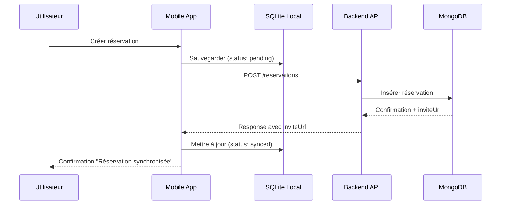
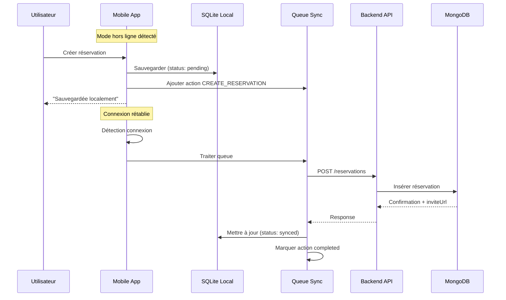
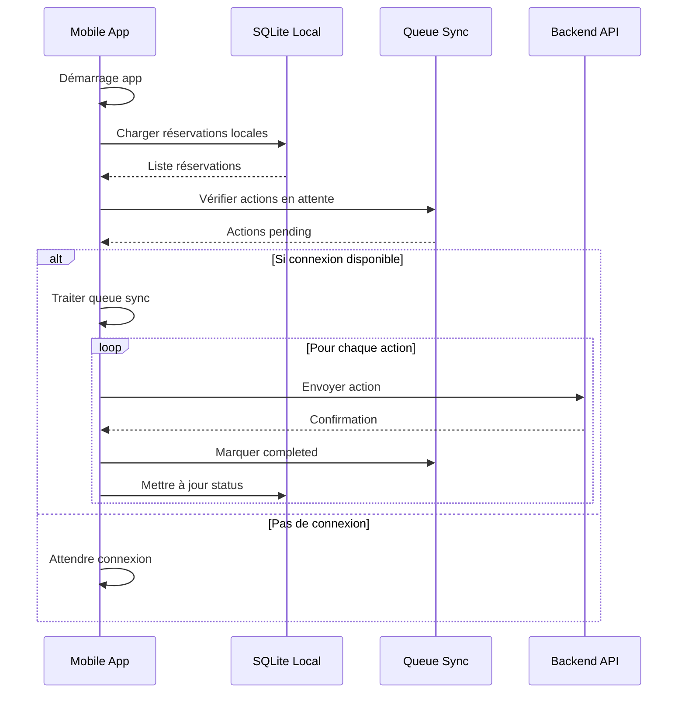
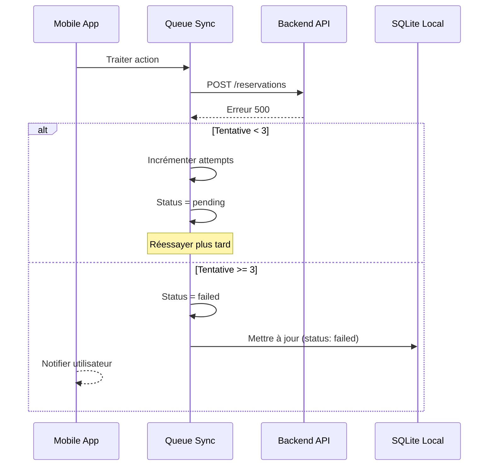

# Diagramme de séquence - Synchronisation BDD locale/distante

## Scénario 1 : Réservation en ligne

## Scénario 2 : Réservation hors ligne

## Scénario 3 : Synchronisation au démarrage

## Scénario 4 : Gestion des erreurs de sync

## Architecture des données

### SQLite Local (Mobile)
- **Table `reservations`** : Réservations de l'utilisateur uniquement
- **Table `sync_queue`** : Actions à synchroniser avec le serveur
- **Données strictement nécessaires** : Pas de cache complet, seulement ce qui concerne l'utilisateur

### MongoDB (Serveur)
- **Collection `reservations`** : Toutes les réservations
- **Collection `slots`** : Tous les créneaux
- **Collection `terrains`** : Tous les terrains
- **Collection `users`** : Tous les utilisateurs

## Stratégie de synchronisation

1. **Priorité locale** : L'utilisateur peut toujours voir ses réservations
2. **Sync opportuniste** : Synchronisation dès que possible
3. **Queue persistante** : Les actions hors ligne ne sont jamais perdues
4. **Retry avec backoff** : 3 tentatives maximum avec délai croissant
5. **Indicateurs visuels** : Status de sync visible (SYNC/EN ATTENTE/ERREUR)

## Avantages de cette approche

✅ **Fonctionnement hors ligne** : L'utilisateur peut réserver même sans connexion  
✅ **Données minimales** : Seulement les réservations de l'utilisateur en local  
✅ **Synchronisation robuste** : Gestion des erreurs et retry automatique  
✅ **UX fluide** : Feedback immédiat, sync transparente  
✅ **Cohérence** : Les données locales et distantes restent synchronisées  
